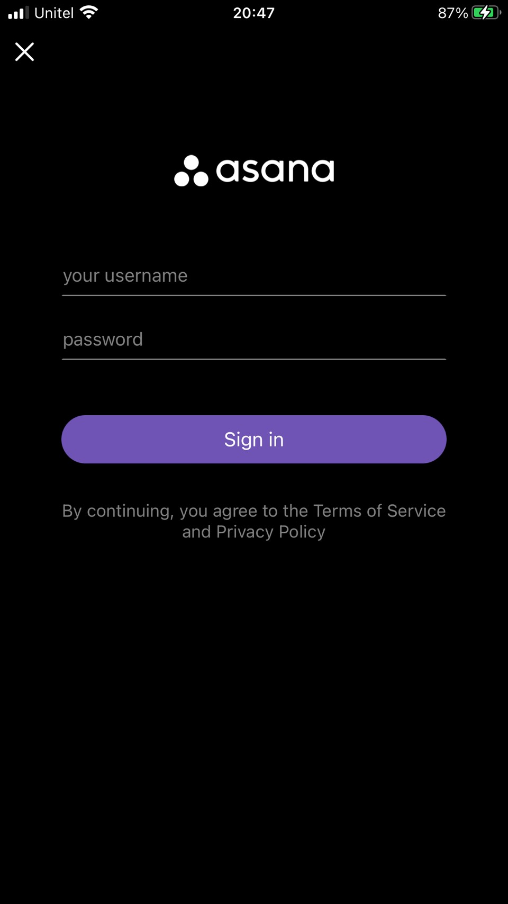
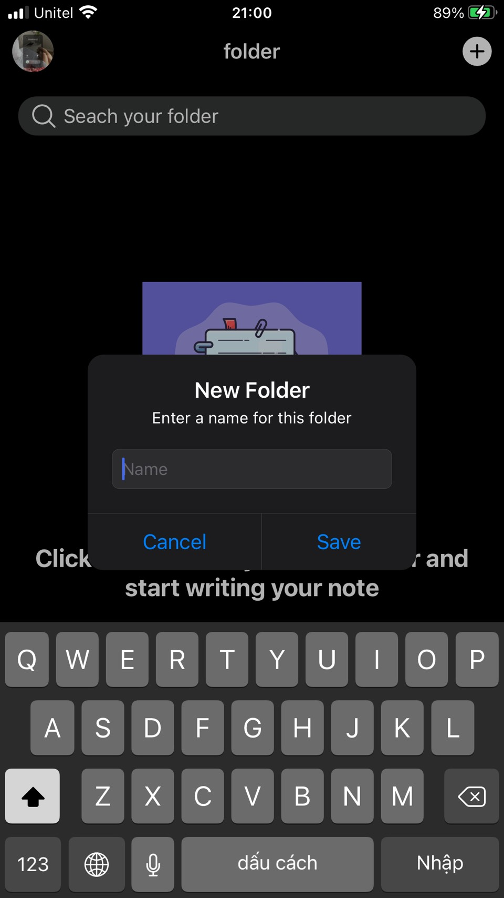
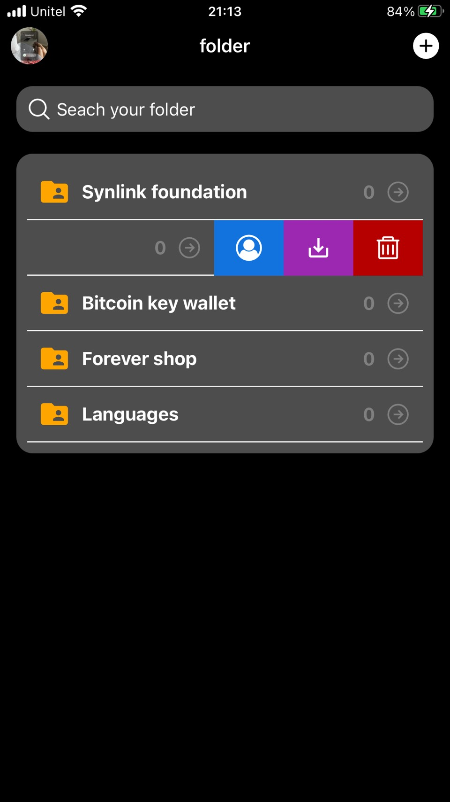
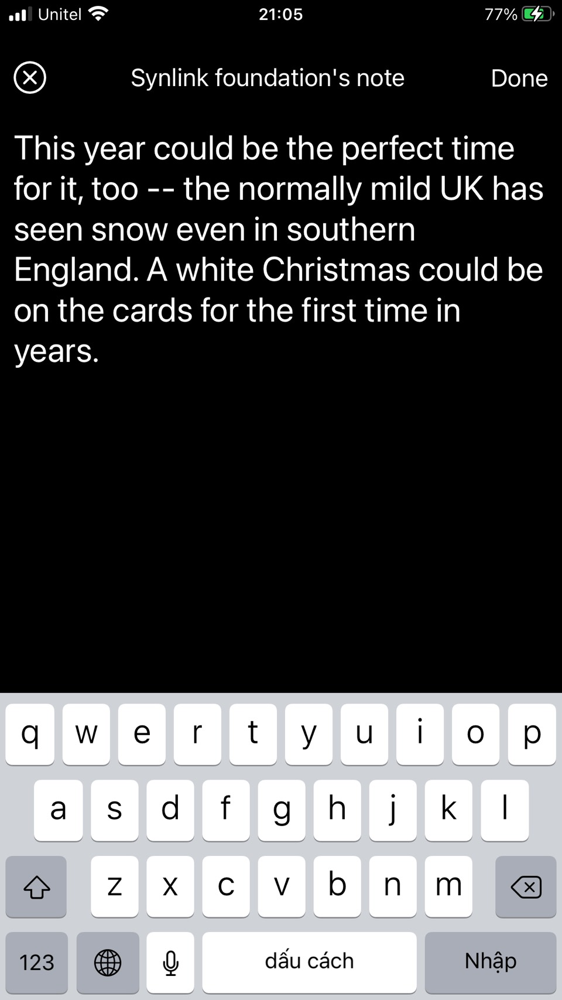

# note-writing-mobile-app
A full-stack react native app to create, write and store your important notes using Back4App/Parse Database. Also, the app provides full user authentication feature.
The app's UI, UX still need improving, though

> 

  

>

### Stack i use to develop the app
- react native framework (javascript)
- Back4App (backend-as-a-service platform) Database with Parse react native SDK
- Redux
- React native reanimatable and Lottie (render some animations)

>

### App features and upcoming updates
- full user authentication (sign-in, sign-up with user data stored in parse database)
- User can create folders, write notes in those folders (notes stored in the database)
- Upcoming updates: working to add delete, download and share notes, folders features; enhance UI, UX (:laughing: :laughing: :laughing:)
